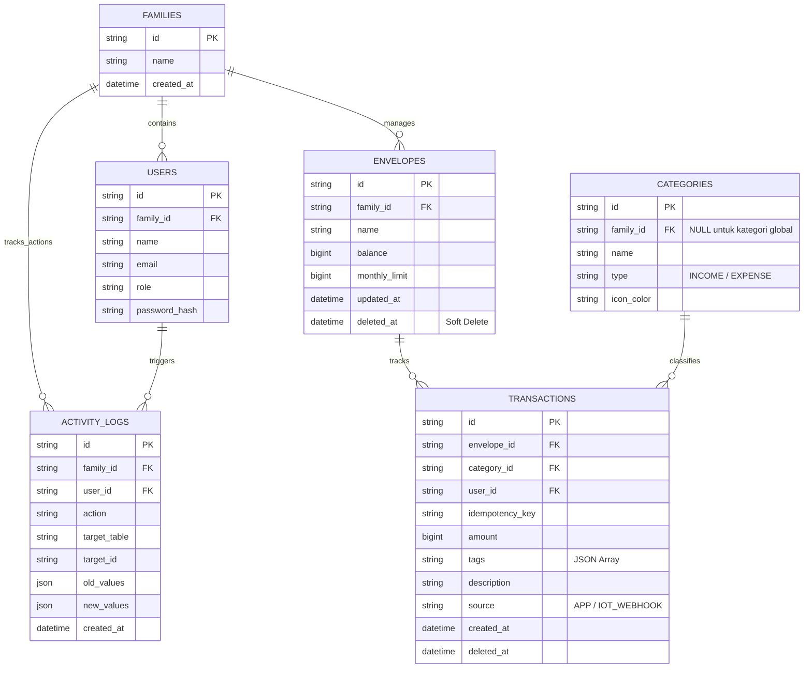

# PRD — Project Requirements Document: Family Finance Tracker (Bun & ElysiaJS Edition)

## 1. **Overview**
Aplikasi ini adalah platform **Family Finance Tracker** berbasis web yang dirancang khusus untuk mengelola arus kas keluarga dengan performa ekstrem, keamanan tingkat tinggi, dan fleksibilitas jangka panjang. Dibangun di atas ekosistem modern (Bun & ElysiaJS), aplikasi ini memecahkan masalah pencatatan keuangan bersama tanpa khawatir bentrok data, kehilangan data historis, atau kebocoran akses.

**Masalah utama yang diselesaikan:**
* **Pencatatan Pemasukan & Pengeluaran yang Tercecer:** Tidak adanya sistem pencatatan arus kas keluarga yang terpusat dan transparan.
* Sulitnya melacak pengeluaran bersama secara *real-time*.
* Kebocoran anggaran karena tidak adanya sistem alokasi pos pengeluaran (*enveloping*) yang ketat.
* Aplikasi keuangan tradisional sering mengalami *floating-point error* (selisih desimal) dan isu *race condition* saat dua orang mencatat transaksi secara bersamaan.
* Kehilangan jejak audit atau data historis rusak ketika kategori pengeluaran dihapus.

**Tujuan utama aplikasi:**
* **Mendukung Pencatatan Arus Kas Komprehensif:** Menyediakan fitur pencatatan akurat agar neraca keuangan selalu seimbang.
* Menyediakan dasbor sentralistik untuk memantau kesehatan finansial keluarga.
* Mencegah pengeluaran berlebih melalui *Enveloping System*.
* Memberikan *Monthly Family Insights* yang personal dan *actionable*.
* Membangun arsitektur backend super cepat dan aman (*Atomic Updates* & *Pessimistic Locking*).
* **Maintenance & Skalabilitas:** Menyediakan sistem yang mudah dilacak (*audit trail*), tahan banting, dan fleksibel terhadap perubahan fitur di masa depan.

## 2. **Requirements**
* **Akurasi Data Mutlak:** Sistem dilarang menggunakan tipe data pecahan (FLOAT/DOUBLE). Semua nominal uang wajib disimpan sebagai Integer di MySQL (tipe data BIGINT, disimpan dalam satuan sen) dan dibagi 100 saat ditampilkan di UI.
* **Konkurensi & Keamanan Multi-User:** Tahan terhadap *race conditions* menggunakan *Pessimistic Locking* (sintaks `FOR UPDATE` via Drizzle) di dalam blok `db.transaction()`.
* **Integritas Transaksi Finansial:** Setiap transaksi wajib menyertakan **Idempotency Key** (UUID) dari *frontend* untuk mencegah duplikasi pencatatan.
* **Mekanisme Soft Deletes:** Data transaksi, pos anggaran, dan tagihan tidak boleh dihapus permanen (`HARD DELETE`). Semua wajib menggunakan `SOFT DELETE` (kolom `deleted_at`) untuk menjaga integritas laporan historis.
* **Audit Trail Mandatori:** Setiap mutasi saldo atau perubahan limit pos anggaran wajib mencatat *Activity Log* untuk mempermudah investigasi data.
* **Autentikasi Super Aman:** Token sesi (JWT) hanya boleh disimpan di dalam `HttpOnly, Secure, SameSite='lax'` Cookies. Dilarang menggunakan LocalStorage.
* **Otomatisasi Validasi:** Setiap API endpoint di ElysiaJS wajib menggunakan objek validasi `t` (TypeBox) untuk menyaring data dan men-generate dokumentasi Swagger otomatis.
* **Penanganan Error Global:** Menggunakan hook `.onError()` di ElysiaJS untuk menangkap *crash* dan mengembalikan respon JSON yang ramah pengguna.
* **Offline-First Mode (PWA):** Frontend Next.js harus dikonfigurasi sebagai Progressive Web App dengan *Service Workers* agar pencatatan transaksi tetap bisa dilakukan saat koneksi internet terputus, dan otomatis disinkronkan saat *online*.

## 3. **Core Features**
* **Multi-User & Multi-Role Keuangan:** Akses bersama (Admin vs Member) dalam satu entitas keluarga.
* **Sistem Pos Anggaran (Enveloping System):** Membagi uang ke dalam "pos digital" dengan peringatan limit otomatis.
* **Kategori Dinamis & Custom Tags:** Pengguna dapat membuat kategori pengeluaran secara fleksibel dan menambahkan *tags* JSON (misal: `#Liburan2026`) di setiap pencatatan tanpa merusak struktur database.
* **Pencatatan Transaksi Real-Time:** Log masuk/keluar uang secara instan dengan *tagging* anggota keluarga.
* **IoT Smart Automation (Webhook):** Endpoint API khusus untuk menerima *trigger* fisik. Modul *microcontroller* seperti ESP8266 atau Arduino dapat dihubungkan ke sistem ini (misalnya tombol fisik di dapur untuk mencatat pengeluaran rutin secara otomatis tanpa membuka *smartphone*).
* **Central Family Activity Logs:** Halaman admin khusus untuk memantau seluruh log aktivitas penting (siapa, kapan, dan mengubah apa).
* **Monthly Family Insights (Laporan "Wrapped" Bulanan):** Visualisasi interaktif ala *stories* setiap awal bulan yang merangkum pola pengeluaran dengan *copywriting* naratif.
* **One-Click Reallocation (Action Plan):** Rekomendasi otomatis sistem untuk merelokasi sisa limit dari pos yang irit ke pos yang *over-budget* dalam satu klik.
* **Smart Spending Predictions & Milestones:** Analisis *cash flow* historis untuk memprediksi kapan target finansial akan tercapai. Sangat krusial untuk memantau kesiapan dana kebutuhan spesifik yang dinamis, seperti alokasi dana untuk perkembangan balita.
* **Data Portability:** Fitur ekspor data transaksi ke format CSV/JSON.

## 4. **User Flow & Data Flow**

### Flow Pencatatan Transaksi Baru (Offline & Online)
1.  Pengguna menekan "Tambah Transaksi". Next.js meng-generate UUID acak sebagai Idempotency Key.
2.  Pengguna mengisi detail (termasuk *custom tags*) dan menekan "Simpan".
3.  Jika perangkat *offline*, transaksi disimpan di IndexedDB via *Service Worker*.
4.  Jika *online* (atau saat koneksi pulih), data dikirim ke ElysiaJS. ElysiaJS memvalidasi input dengan TypeBox dan mengecek Idempotency Key.
5.  Database melakukan *Pessimistic Locking* pada Pos Anggaran, memperbarui saldo secara atomik, dan mencatat log transaksi.
6.  Frontend menerima respons dan melakukan *Optimistic Update* via React Query.

### Flow Eksekusi Webhook IoT
1.  Perangkat ESP8266/Arduino yang terhubung ke jaringan WiFi mengirim HTTP POST request dengan parameter terenkripsi/token ke endpoint ElysiaJS (`/api/iot-webhook`).
2.  ElysiaJS memverifikasi token dan menerjemahkan *payload* menjadi nilai transaksi tetap (misal: pengeluaran harian galon air).
3.  Transaksi diproses secara atomik ke dalam *database*, memotong pos anggaran yang bersangkutan.

### Flow Penghapusan Pos Anggaran (Soft Delete & Reallocation)
1.  Pengguna memilih untuk menghapus sebuah Pos Anggaran.
2.  Jika ada sisa saldo, sistem memaksa pengguna memilih pos pengalihan.
3.  ElysiaJS membungkus proses dalam `db.transaction()`: memindahkan sisa saldo, mengubah kolom `deleted_at` pada pos lama menjadi waktu saat ini, dan mencatatnya di *Activity Logs*.
4.  Kueri selanjutnya otomatis memfilter data dengan `deleted_at IS NULL`.

## 5. **Architecture**
Arsitektur aplikasi dirancang secara *decoupled* dan modular (*Repository Pattern*).
* **Frontend:** Next.js (Plain JavaScript) + TanStack Query + Tailwind CSS + PWA Service Workers. Menangani UI, *fetching cache*, dan antarmuka *offline*.
* **Backend:** ElysiaJS (di atas Bun). Menangani logika bisnis, *idempotency*, transaksi atomik, validasi, dan integrasi IoT Webhook.
* **Database:** MySQL dengan Drizzle ORM.

## 6. **Database Schema (Future-Proof)**


*(Catatan: Terdapat juga tabel `monthly_insights` untuk menyimpan JSON rekomendasi action plan).*

## 7. **Standar Manajemen Kode & Struktur Folder**
* **Drizzle Kit Migrations:** Skema dikelola lewat `bunx drizzle-kit generate` dan `migrate`.
* **JSDoc & Linters:** Komentar JSDoc diwajibkan untuk *autocomplete* di VS Code, dipadukan dengan ESLint.
* **CORS & Port:** Frontend (Next.js Port 3000) dan Backend (Elysia Port 8000) menggunakan `@elysiajs/cors` dengan `credentials: true`.

**Arsitektur Folder Frontend (Next.js - Feature Driven)**
```text
frontend-next/
├── src/
│   ├── app/                      
│   ├── components/ui/                   
│   └── features/                 
│       ├── authentication/       
│       ├── envelopes/            
│       ├── transactions/         
│       ├── insights/             
│       └── audit-logs/           
```

**Arsitektur Folder Backend (ElysiaJS - Modular)**
```text
backend-elysia/
├── src/
│   ├── db/
│   │   ├── index.js              
│   │   └── schema.js             
│   ├── features/                 
│   │   ├── auth/
│   │   ├── envelopes/
│   │   ├── transactions/
│   │   ├── categories/
│   │   ├── insights/             
│   │   ├── logs/
│   │   └── iot-webhook/          # Modul Endpoint IoT Automation
│   ├── middlewares/              
│   └── index.js                  
```
