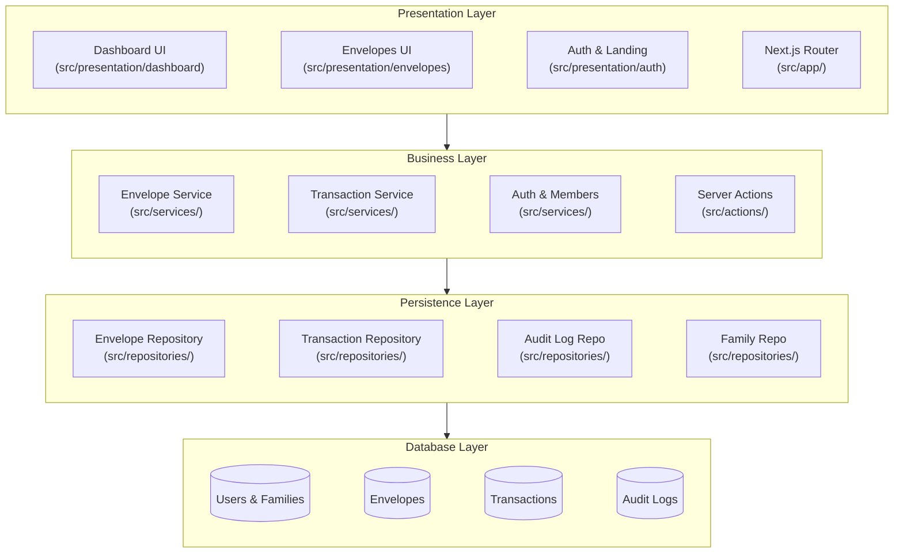

# FamFi Architecture Overview

Aplikasi FamFi dibangun menggunakan **Strict Layered Architecture** (Arsitektur Berlapis Ketat) pada ekosistem Next.js. Pendekatan ini memastikan setiap komponen memiliki satu tanggung jawab (*Single Responsibility Principle*) dan hanya dapat berinteraksi dengan lapisan yang berada tepat di bawahnya.

## Diagram Arsitektur

---

## Penjelasan Tiap Lapisan (Layers)

### 1. Presentation Layer (Lapisan Visual & UI)
**Tujuan:** Mengatur tampilan antarmuka (UI), mengelola *state* React, dan mendengarkan aksi dari pengguna (seperti klik tombol atau input form). Lapisan ini sama sekali tidak boleh berisi logika bisnis atau kueri database.
- **`src/presentation/`**: Direktori utama untuk seluruh komponen UI, yang dikelompokkan berdasarkan fitur (misal: `dashboard`, `envelopes`, `auth`).
- **`src/app/`**: Hanya bertugas sebagai *Router* (pengatur URL). File `page.js` di sini sengaja dibuat sangat tipis (*Thin Wrapper*) yang sekadar merender komponen dari `src/presentation/`.

### 2. Business Layer (Lapisan Logika Bisnis)
**Tujuan:** Jantung dari aplikasi. Semua aturan sistem (misalnya: *Apakah saldo amplop cukup?*, *Apakah user ini adalah admin?*) diproses di sini. Lapisan ini murni Javascript/Typescript dan sama sekali tidak tahu menahu tentang wujud HTML/CSS.
- **`src/services/`**: Menampung *Core Logic* (seperti `envelopeService.js`, `transactionService.js`).
- **`src/actions/`**: Menampung Next.js Server Actions yang menjembatani panggilan dari UI ke Services. Action bertindak sebagai *Controller*.

### 3. Persistence Layer (Lapisan Akses Data)
**Tujuan:** Satu-satunya pintu gerbang untuk mengakses atau memodifikasi database. Di sinilah sintaks SQL atau perintah klien Supabase diletakkan.
- **`src/repositories/`**: Memisahkan operasi *Query* ke dalam fungsi-fungsi modular (seperti `envelopeRepository.js`, `transactionRepository.js`). Jika suatu saat database diganti (misal dari Supabase ke MongoDB), kita hanya perlu mengubah lapisan ini tanpa menyentuh Business Layer atau UI.

### 4. Database Layer (Infrastruktur Data)
**Tujuan:** Tempat penyimpanan data secara persisten dan permanen, penegakan integritas data (*Foreign Keys*), serta keamanan tingkat baris (*Row Level Security*).
- Diimplementasikan menggunakan **Supabase Cloud (PostgreSQL)**, mengatur tabel seperti `users`, `families`, `envelopes`, dan `transactions`.

---

## Aliran Data (Data Flow)

Saat pengguna melakukan aksi di antarmuka, aliran datanya selalu terstruktur, tidak pernah melompati lapisan:

1. **User** mengeklik tombol di `Presentation Layer` (Contoh: *Transfer Saldo Amplop*).
2. UI memanggil fungsi dari `Server Actions` di **Business Layer**.
3. `Action` melemparkan parameter ke `TransactionService` di **Business Layer** untuk divalidasi (Cek apakah saldo cukup).
4. Jika valid, `TransactionService` memanggil fungsi eksekusi di `TransactionRepository` pada **Persistence Layer**.
5. Repositori menjalankan perintah *SQL/Supabase Client* untuk merubah saldo di **Database Layer**.
6. Hasilnya dikembalikan secara berantai naik kembali ke UI, dan pengguna melihat notifikasi sukses.
